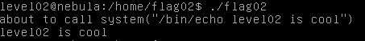
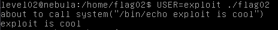
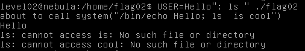
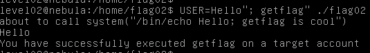

Following the train of thought of the past exercise, we can read in the code of the file `/home/flag02/flag02` that it is reading a variable:

```c
  asprintf(&buffer, "/bin/echo %s is cool", getenv("USER"));
  printf("about to call system(\"%s\")\n", buffer);

  system(buffer);
```

and also using it in the system() call. We can dissect the buffer:

The $USER variable is being called, so when you run the program, it prints:



because the default is set to the username, but if we set the variable before the actual program we can see how it calls it:



it transforms the variable into a string.

The buffer in the code is effectively `"/bin/echo $USER is cool"`, if we change the $USER variable to `Hello"; ls"`, the buffer can be translated to:

```
"/bin/echo Hello"; ls ""
```

so this means that the string will finish just before the echo by using the `;`, thus enabling us to execute an arbitrary command `echo` in between the string.



Using that exploit we can use the command `getflag` and congrats, we can now proceed to the next level:


